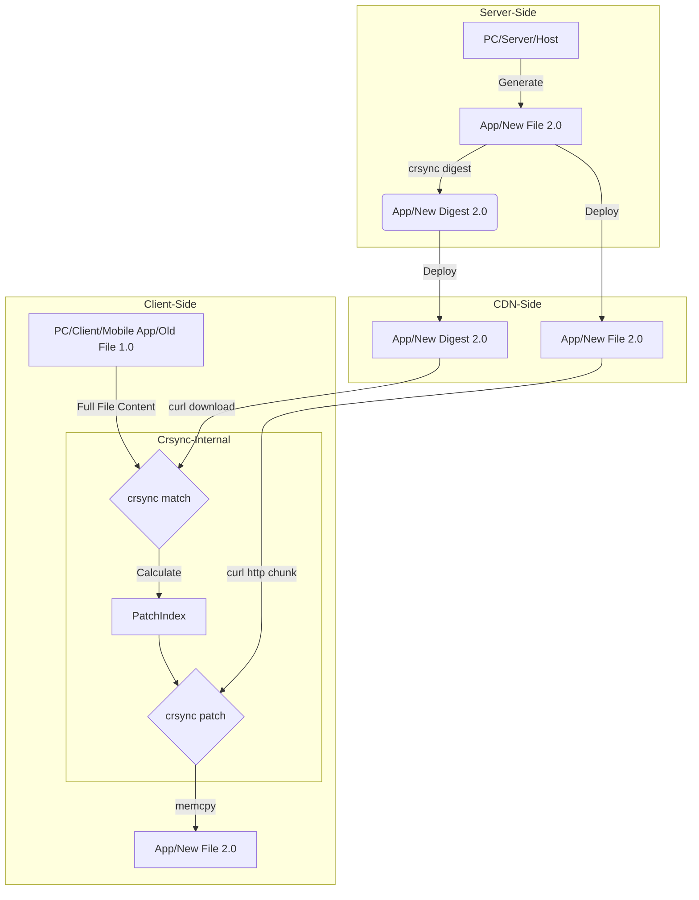

Workflow
----

```mermaid
graph TD
    subgraph Server-Side
    Remote[PC/Server/Host] -->|Generate|File2[App/New File 2.0]
    File2 -->|crsync digest| Digest2(App/New Digest 2.0)
    end

    subgraph CDN-Side
    File2CDN[App/New File 2.0]
    Digest2CDN[App/New Digest 2.0]
    end

    subgraph Client-Side
    File1[PC/Client/Mobile App/Old File 1.0]

        subgraph Crsync-Internal
        CrsyncMatch{crsync match} -->|Calculate|PatchIndex
        PatchIndex -->CrsyncPatch{crsync patch}
        end

    CrsyncPatch -->|memcpy|File2Local[App/New File 2.0]
    end

File2 -->|Deploy|File2CDN
Digest2 -->|Deploy|Digest2CDN
File1 --> |Full File Content|CrsyncMatch
Digest2CDN -->|curl download|CrsyncMatch
File2CDN -->|curl http chunk|CrsyncPatch
```
